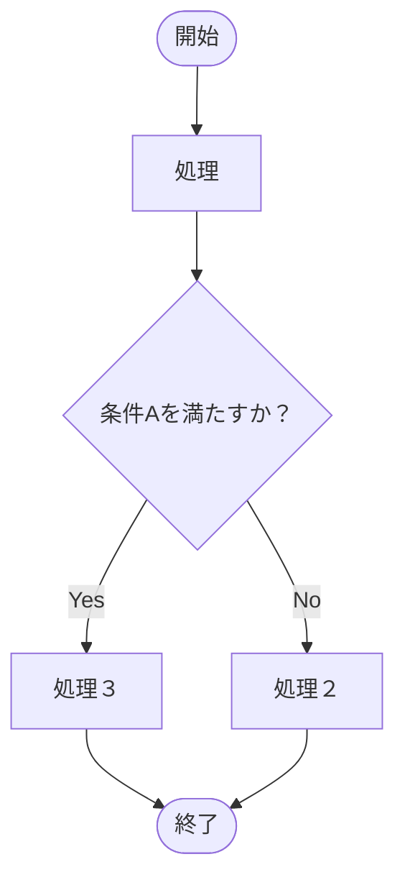

# アルゴリズムとデータ構造
アルゴリズムとは、なんらかの問題を解決するためにコンピュータに実行させる処理の手順を明確に定義したもの。

データ構造は、プログラムで処理をするデータがどういった構造になっているのかを示す用語。
- 連立リスト
- 配列
- スタック
- キュー
- 連想配列
- 木構造
- グラフ構造

## 基本的な処理フロー
プログラムは処理が流れるように進んでいくことから、一連の処理の
順序をフロート呼ぶ。



## GitHub PRテンプレート

[Developers IO](https://dev.classmethod.jp/articles/pull-request-template/)

```shell
mkdir .github
touch .github/PULL_REQUEST_TEMPLATE.md
```